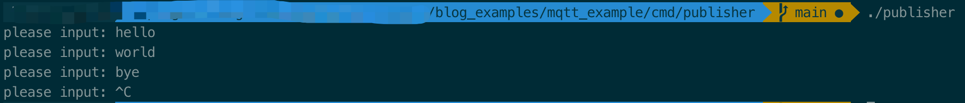
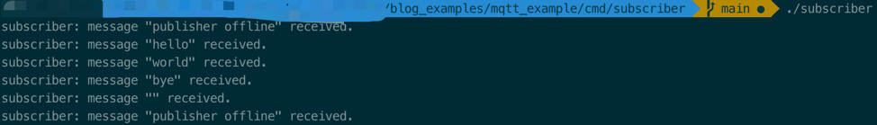

# mqtt_example

## How to use

### prerequirements

1. docker
2. go

### steps

1. go to mqtt_example/cmd/publisher path, and build *publisher*
```shell
go build publisher.go
```

2. go to mqtt_example/cmd/subscriber path, and build *subscriber*
```shell
go build subscriber.go
```

3. start mqtt broker in a terminal
```shell
docker run -p 1883:1883 eclipse-mosquitto:1.4.12
```
output may look like this
```shell
Unable to find image 'eclipse-mosquitto:1.4.12' locally
1.4.12: Pulling from library/eclipse-mosquitto
605ce1bd3f31: Pull complete
ad67714bea01: Pull complete
d2ddf5912b7f: Pull complete
Digest: sha256:bb177e7bd81746fc59b919ccb84b6ffffbe1ec1f7f933fa68c3aca4b4be364b6
Status: Downloaded newer image for eclipse-mosquitto:1.4.12
mosquitto[1]: mosquitto version 1.4.12 (build date 2017-06-01 13:03:46+0000) starting
mosquitto[1]: Config loaded from /mosquitto/config/mosquitto.conf.
mosquitto[1]: Opening ipv4 listen socket on port 1883.
mosquitto[1]: Opening ipv6 listen socket on port 1883.
```

4. go to mqtt_example/cmd/publisher path, and start *publisher* in another 
   terminal
```shell
./publisher
```

5. go to mqtt_example/cmd/subscriber path, and start *subscriber* in the third 
   terminal
```shell
./subscriber
```

6. then you can type in *publisher* terminal and *subscriber* terminal will 
   receive the messages, just like this:
   
terminal publisher:

terminal subscriber:
